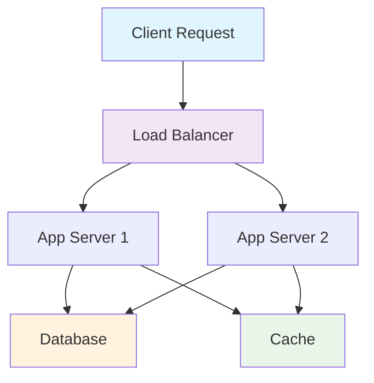

# HedgeDoc Presentation Features - Advanced Guide

## Overview

HedgeDoc integrates seamlessly with reveal.js to create powerful, interactive presentations directly from markdown. This guide covers advanced presentation techniques, animations, and interactive features for compelling presentations.

## Basic Presentation Setup

### Slide Mode Activation

Add presentation metadata to the beginning of your document:

```markdown
---
title: Your Presentation Title
description: Brief description
tags: presentation, training
slideOptions:
  theme: white
  transition: slide
  backgroundTransition: fade
  center: true
  progress: true
  controls: true
  mouseWheel: false
  history: true
  keyboard: true
---

# Your Presentation Title
## Subtitle or Description

---

# First Slide Content
```

### Basic Slide Separation

```markdown
# Slide 1 Title
Content for first slide

---

# Slide 2 Title
Content for second slide

----

# Vertical Slide
This creates a vertical slide under the previous one
```

## Advanced Slide Options

### Custom Slide Configuration

```markdown
---
slideOptions:
  # Theme Selection
  theme: white           # white, black, league, beige, sky, night, serif, simple, solarized
  
  # Transitions
  transition: slide      # none, fade, slide, convex, concave, zoom
  transitionSpeed: fast  # slow, default, fast
  backgroundTransition: fade
  
  # Navigation
  controls: true         # Show navigation controls
  progress: true         # Show progress bar
  slideNumber: true      # Show slide numbers
  history: true          # Enable browser history
  keyboard: true         # Enable keyboard navigation
  overview: true         # Enable overview mode (ESC)
  center: true           # Center slides vertically
  touch: true            # Enable touch navigation
  loop: false            # Loop presentation
  
  # Behavior
  mouseWheel: false      # Mouse wheel navigation
  hideAddressBar: true   # Hide address bar on mobile
  previewLinks: false    # Open links in preview
  
  # Timing
  autoSlide: 0           # Auto-advance slides (0 = disabled)
  autoSlideStoppable: true
  
  # Fragments
  fragments: true        # Enable slide fragments
  
  # Display
  width: 960            # Presentation width
  height: 700           # Presentation height
  margin: 0.1           # Factor of display size
  minScale: 0.2         # Minimum scale
  maxScale: 1.5         # Maximum scale
---
```

## Slide Layouts and Formatting

### Title Slide

```markdown
# Workshop Title
## Subtitle or Company Name

### Presenter Information
- **Presenter:** John Doe
- **Position:** Senior Architect
- **Email:** john.doe@company.com
- **Date:** September 2025

**Speaker Notes:** Welcome message and presentation overview.
```

### Two-Column Layout

```markdown
# Comparison Slide

<div class="container">
<div class="col">

## Left Column
- Point 1
- Point 2
- Point 3

</div>
<div class="col">

## Right Column
- Counter-point 1
- Counter-point 2
- Counter-point 3

</div>
</div>

<style>
.container { display: flex; }
.col { flex: 1; margin: 0 10px; }
</style>
```

### Code-Heavy Slides

```markdown
# Implementation Example

## Singleton Pattern

```java
public class DatabaseConnection {
    private static DatabaseConnection instance;
    private Connection connection;
    
    private DatabaseConnection() {
        // Initialize database connection
        this.connection = DriverManager.getConnection(
            "jdbc:postgresql://localhost/mydb"
        );
    }
    
    public static DatabaseConnection getInstance() {
        if (instance == null) {
            synchronized (DatabaseConnection.class) {
                if (instance == null) {
                    instance = new DatabaseConnection();
                }
            }
        }
        return instance;
    }
}
```

**Key Benefits:**
- Single instance guarantee
- Thread-safe implementation
- Lazy initialization
```

### Image-Focused Slides

```markdown
# Architecture Overview


**Key Components:**
- Load Balancer
- Application Servers
- Database Cluster
- Cache Layer
```

## Fragment Animations (Partial Reveals)

### Basic Fragments

```markdown
# Incremental Reveals

- First point appears immediately
- Second point <!-- .element: class="fragment" -->
- Third point <!-- .element: class="fragment" -->
- Fourth point <!-- .element: class="fragment" -->

**Speaker Notes:** Use fragments to control information flow and maintain audience attention.
```

### Fragment Types

```markdown
# Animation Types

<div class="fragment fade-in">Fade in</div>
<div class="fragment fade-out">Fade out (initially visible)</div>
<div class="fragment fade-up">Slide up</div>
<div class="fragment fade-down">Slide down</div>
<div class="fragment fade-left">Slide left</div>
<div class="fragment fade-right">Slide right</div>

<div class="fragment fade-in-then-out">Fade in, then out</div>
<div class="fragment fade-in-then-semi-out">Fade in, then semi-transparent</div>

<div class="fragment grow">Grow</div>
<div class="fragment shrink">Shrink</div>
<div class="fragment strike">Strike through</div>

<div class="fragment highlight-red">Highlight red</div>
<div class="fragment highlight-green">Highlight green</div>
<div class="fragment highlight-blue">Highlight blue</div>
```

### Sequential Code Reveals

```markdown
# Building a Class

```java
public class UserService {
    // Step 1: Basic structure appears first
    
    private UserRepository repository; // fragment
    
    public UserService(UserRepository repository) { // fragment
        this.repository = repository; // fragment
    } // fragment
    
    public User createUser(String name, String email) { // fragment
        // Validation logic // fragment
        if (name == null || email == null) { // fragment
            throw new IllegalArgumentException("Name and email required"); // fragment
        } // fragment
        
        User user = new User(name, email); // fragment
        return repository.save(user); // fragment
    } // fragment
} // fragment
```

**Speaker Notes:** Walk through each part of the implementation step by step.
```

## Interactive Elements

### Clickable Navigation

```markdown
# Table of Contents

<div style="text-align: left;">

1. [Introduction](#/1)
2. [Design Patterns Overview](#/2)  
3. [Singleton Pattern](#/3)
4. [Factory Pattern](#/4)
5. [Hands-on Exercises](#/5)
6. [Q&A](#/6)

</div>

**Navigation:** Click any topic to jump directly to that section.
```

### Embedded Polls and Questions

```markdown
# Interactive Question

## Which design pattern ensures only one instance exists?

<div style="font-size: 0.8em;">

A) Factory Pattern  
B) Observer Pattern  
C) Singleton Pattern  
D) Strategy Pattern  

</div>

<!-- Reveal answer after discussion -->
<div class="fragment highlight-green" style="font-size: 1.2em; margin-top: 40px;">
**Answer: C) Singleton Pattern**
</div>

**Speaker Notes:** Pause for audience response before revealing answer.
```

### Interactive Code Exercises

```markdown
# Coding Challenge

## Implement the missing method:

```java
public class Calculator {
    public double add(double a, double b) {
        return a + b;
    }
    
    public double multiply(double a, double b) {
        // Your implementation here
        // Audience participation
    }
}
```

<div class="fragment">

## Solution:

```java
public double multiply(double a, double b) {
    return a * b;
}
```

</div>

**Speaker Notes:** Give audience 1-2 minutes to think, then reveal solution.
```

## Speaker Notes Integration

### Comprehensive Speaker Notes

```markdown
# Design Patterns Introduction

## What are Design Patterns?

- Reusable solutions to common problems
- Proven approaches in software design  
- Communication tools between developers
- Not code, but concepts and relationships

**Speaker Notes:** 
Welcome to our design patterns workshop. Design patterns are like recipes - they provide tested solutions to problems that developers encounter repeatedly. 

Key points to emphasize:
- They're not specific to any programming language
- They represent best practices evolved over time
- They improve code maintainability and readability
- They create a common vocabulary among developers

Story: Gang of Four book from 1994 established 23 fundamental patterns that are still relevant today. Ask audience: "How many of you have heard of the Singleton pattern?"

Timing: Spend 5 minutes on this slide, allowing for questions.
```

### Speaking Cues and Timing

```markdown
# Complex Technical Concept

## Dependency Injection

<!-- SPEAKING CUE: Start with simple analogy -->

**Analogy:** Like a restaurant kitchen
- Chef doesn't create ingredients
- Ingredients are provided by suppliers
- Chef focuses on cooking, not sourcing

**Speaker Notes:**
[TIMING: 2 minutes]
Start with the restaurant analogy to make this accessible. Many developers find DI abstract, so grounding it in familiar concepts helps.

[INTERACTION: Ask question]
"Who here has worked in a restaurant or kitchen?" - builds connection

[TRANSITION CUE]  
"Now let's see how this applies to code..."

[DEMO PREPARATION]
Have IDE open with example ready to show live coding.
```

## Visual Enhancements

### Custom Styling

```markdown
<style>
/* Slide-specific styles */
.highlight-box {
    background-color: #f0f8ff;
    border-left: 5px solid #007acc;
    padding: 20px;
    margin: 20px 0;
    border-radius: 5px;
}

.code-emphasis {
    background-color: #fffbdd;
    padding: 2px 6px;
    border-radius: 3px;
    font-family: 'Courier New', monospace;
}

.speaker-emphasis {
    color: #d63384;
    font-weight: bold;
    font-size: 1.1em;
}

.two-column {
    display: grid;
    grid-template-columns: 1fr 1fr;
    gap: 40px;
    align-items: start;
}

.center-content {
    text-align: center;
    display: flex;
    flex-direction: column;
    justify-content: center;
    min-height: 400px;
}
</style>

# Styled Content Example

<div class="highlight-box">
<strong>Key Concept:</strong> Singleton pattern ensures only one instance of a class exists throughout the application lifecycle.
</div>

<div class="two-column">
<div>

## Benefits
- Memory efficiency
- Global access point
- Controlled instantiation

</div>
<div>

## Use Cases
- Database connections
- Logger instances
- Configuration objects

</div>
</div>
```

### Background Images and Themes

```markdown
<!-- Slide with custom background -->
<!-- .slide: data-background="https://example.com/background.jpg" data-background-opacity="0.3" -->

# Welcome to Design Patterns Workshop

<div style="background-color: rgba(255,255,255,0.9); padding: 30px; border-radius: 10px;">

## Learning Objectives
- Master fundamental patterns
- Implement real-world solutions
- Develop pattern recognition skills

</div>
```

### Progressive Disclosure

```markdown
# Complex Architecture

<!-- Start with simple view -->


----

# Adding Complexity - Layer 1

<!-- Add database layer -->
 <!-- .element: class="fragment" -->

----

# Adding Complexity - Layer 2  

<!-- Add caching -->
 <!-- .element: class="fragment" -->

----

# Complete Architecture

<!-- Final complex view -->


**Speaker Notes:** Build complexity gradually to avoid overwhelming audience.
```

## Advanced Presentation Techniques

### Nested Slides (Vertical Navigation)

```markdown
# Main Topic: Design Patterns

---

# Creational Patterns

----

## Singleton Pattern
- Ensures single instance
- Global access point
- Lazy initialization

----

## Factory Pattern  
- Creates objects without exposing logic
- Encapsulates object creation
- Supports extensibility

---

# Structural Patterns

----

## Adapter Pattern
- Bridge incompatible interfaces
- Legacy system integration
- Third-party library wrapping

----

## Decorator Pattern
- Add behavior dynamically
- Alternative to inheritance
- Flexible enhancement
```

### Auto-Advancing Slides

```markdown
---
slideOptions:
  autoSlide: 5000        # Advance every 5 seconds
  autoSlideStoppable: true # Stop on user interaction
---

# Timed Presentation

This slide will automatically advance in 5 seconds.

---

# Interactive Control

User interaction stops auto-advance.
```

### Presentation State Management

```markdown
# Presentation Flow Control

## Agenda Management

- [x] Introduction Complete
- [x] Theory Covered  
- [ ] Hands-on Exercise (Current)
- [ ] Q&A Session
- [ ] Wrap-up

**Current Focus:** Implementing patterns in your environment

**Speaker Notes:** Check time remaining. If behind schedule, skip advanced examples and focus on core implementation.
```

## Code Presentation Best Practices

### Syntax Highlighting Configuration

```markdown
# Multi-Language Code Display

## Java Implementation
```java
@Service
public class UserService {
    @Autowired
    private UserRepository userRepository;
    
    public User createUser(CreateUserRequest request) {
        User user = User.builder()
            .name(request.getName())
            .email(request.getEmail())
            .build();
        
        return userRepository.save(user);
    }
}
```

## TypeScript Equivalent
```typescript
@Injectable()
export class UserService {
    constructor(
        private userRepository: UserRepository
    ) {}
    
    async createUser(request: CreateUserRequest): Promise<User> {
        const user = new User({
            name: request.name,
            email: request.email
        });
        
        return await this.userRepository.save(user);
    }
}
```

**Comparison Points:**
- Annotation differences (`@Service` vs `@Injectable`)
- Type system integration
- Async/await patterns
```

### Live Code Editing Integration

```markdown
# Live Coding Session

## CodePen Integration

<iframe height="400" style="width: 100%;" scrolling="no" title="Singleton Pattern Demo" src="https://codepen.io/youruser/embed/demo?height=400&theme-id=light&default-tab=js,result" frameborder="no" loading="lazy" allowtransparency="true" allowfullscreen="true">
</iframe>

**Interaction:** Modify the code above to implement thread safety.

**Speaker Notes:** Encourage audience to fork the CodePen and experiment.
```

## Responsive Design Features

### Mobile-Friendly Presentations

```markdown
<style>
/* Responsive styles */
@media (max-width: 768px) {
    .two-column {
        grid-template-columns: 1fr;
        gap: 20px;
    }
    
    .large-text {
        font-size: 0.8em;
    }
    
    .code-block {
        font-size: 0.7em;
    }
}

@media (min-width: 1200px) {
    .large-screen {
        font-size: 1.2em;
    }
}
</style>

# Responsive Content

<div class="two-column">
<div class="large-text">

## Desktop View
Full detailed content with comprehensive examples and extensive code samples.

</div>
<div class="large-text">

## Mobile View  
Condensed content optimized for smaller screens with focused key points.

</div>
</div>
```

### Touch Navigation

```markdown
---
slideOptions:
  touch: true           # Enable touch navigation
  touchWrapper: true    # Enable touch on entire slide
---

# Touch-Enabled Presentation

**Navigation:**
- Swipe left/right for horizontal slides
- Swipe up/down for vertical slides  
- Tap for fragment advancement
- Pinch to zoom (overview mode)

**Mobile Optimization:**
- Larger touch targets
- Optimized font sizes
- Simplified animations
```

## Integration with External Tools

### Mermaid Diagrams

```markdown
# System Architecture



**Architecture Benefits:**
- High availability through redundancy
- Performance optimization via caching
- Scalability through load balancing
```

### Mathematical Formulas

```markdown
# Algorithm Complexity

## Time Complexity Analysis

Binary Search: $O(\log n)$

$$T(n) = T(n/2) + O(1)$$

**Recurrence Resolution:**
$$T(n) = O(\log n)$$

## Space Complexity

Iterative Implementation: $O(1)$  
Recursive Implementation: $O(\log n)$

**Trade-off:** Memory vs. Code Clarity
```

### External Data Integration

```markdown
# Real-time Data Display

<div id="metrics-dashboard">
<!-- Content loaded via JavaScript -->
</div>

<script>
// Fetch real-time metrics
async function loadMetrics() {
    try {
        const response = await fetch('/api/metrics');
        const data = await response.json();
        
        document.getElementById('metrics-dashboard').innerHTML = `
            <h3>Current System Metrics</h3>
            <ul>
                <li>Active Users: ${data.activeUsers}</li>
                <li>Response Time: ${data.responseTime}ms</li>
                <li>Error Rate: ${data.errorRate}%</li>
            </ul>
        `;
    } catch (error) {
        console.error('Failed to load metrics:', error);
    }
}

// Load data when slide becomes active
loadMetrics();
</script>

**Live System Status:** Updated every 30 seconds during presentation.
```

## Performance Optimization

### Image Optimization

```markdown
# Performance Best Practices

## Image Usage
- Use WebP format when possible
- Optimize file sizes (< 500KB recommended)
- Provide fallbacks for older browsers
- Use CDN for image delivery

## Code Examples
```html
<picture>
  <source srcset="diagram.webp" type="image/webp">
  
</picture>
```

## Asset Management
- Preload critical images
- Lazy load off-screen content
- Use appropriate image dimensions
- Implement progressive enhancement
```

### Loading Performance

```markdown
---
slideOptions:
  preloadIframes: false    # Don't preload embedded content
  parallaxBackgroundImage: false  # Disable heavy backgrounds
  transition: 'none'       # Fastest transition
---

# High-Performance Presentation

## Optimization Strategies
- Minimize embedded content
- Use efficient transitions
- Optimize image sizes
- Reduce JavaScript dependencies
- Enable browser caching

**Loading Time Target:** < 2 seconds initial load
```

This comprehensive guide provides everything needed to create engaging, professional presentations with HedgeDoc and reveal.js, from basic slides to advanced interactive features.